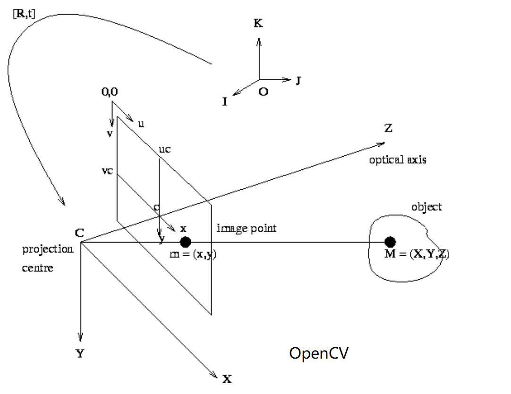

# A custom-data friendly [NeuS](https://github.com/Totoro97/NeuS)

This project is forked from [NeuS](https://github.com/Totoro97/NeuS) but is **more friendly with training on custom data**. 
We convert the coordinate from NeuS space to the more common **NeRF space** (or **OpenCV space**).
It also adds a more detailed guidance on how to use colmap to build your own NeuS datasets and fixes some bugs I encountered.

<p float="left">
    
    
</p>

## Setup

Clone this repository

```shell
git clone https://github.com/Tianhang-Cheng/NeuS_friendly.git
cd NeuS_friendly
pip install -r requirements.txt
```

or clone original NeuS and **copy "models/dataset.py", "models/fields.py" to your project**

```shell
git clone https://github.com/Totoro97/NeuS.git
cd NeuS
pip install -r requirements.txt
```

## Extract colmap pose from custom multi-view image

First, use COLMAP to extract camera poses and coarse 3D points cloud from multi-view images. Here we use the "hotdog" from NeRF-synthetic dataset, which contains 100 training images. Here is the GUI version of COLMAP:

<p float="left">
    
    
</p>

**Example multiview data**   **Colmap GUI**

Then, save the "points3D.txt", "cameras.txt", "images.txt" to any path. 

After that, modify the path and run the one of the following command for **twice**:
In the first runining, this script will generate a .xyz file and you can use MeshLab to edit the interesting area. Save the .xyz inplace. 
In the second runining, this script will read bbox from .xyz and prepare the dataset.

```shell
# without mask
python process_custom_data.py --colmap_txt_dir 'any/path1' --raw_image_dir 'any/path2' --output_dir 'any/path3'
# or with mask
python process_custom_data.py --colmap_txt_dir 'any/path1' --raw_image_dir 'any/path2' --raw_mask_dir 'any/path3' --output_dir 'any/path4'
```

<p float="left">
  
</p>

At last, modify the configs/ based on your setting.

If you turn on '--viz_bbox' when running process_custom_data.py, you will see the following output
<p float="left">
  
  
  
</p>
 
## Training

- **Training without mask**
- 
```bash
# example
python exp_runner.py --mode train --conf ./confs/custom_colmap_data_womask.conf --case hotdog
```

- **Training with mask**

```shell
python exp_runner.py --mode train --conf ./confs/wmask.conf --case <case_name>
```

- **Extract surface from trained model** 

not tested yet

```shell
python exp_runner.py --mode validate_mesh --conf <config_file> --case <case_name> --is_continue # use latest checkpoint
```

The corresponding mesh can be found in `exp/<case_name>/<exp_name>/meshes/<iter_steps>.ply`.

- **View interpolation**

not tested yet

```shell
python exp_runner.py --mode interpolate_<img_idx_0>_<img_idx_1> --conf <config_file> --case <case_name> --is_continue # use latest checkpoint
```

## Appendix

### Bugs of original NeuS

1. **Error occurred while parsing config**

```bash
(on windows) pyparsing.exceptions.ParseSyntaxException: , found '='  (at char 872), (line:50, col:14)
```

Solution: delete these content in .conf file:
    "d_in_view = 3" and "d_in" of "nerf"
    "d_in" and "d_out" of "sdf_network"
    "d_out" and "d_in" of "rendering_network"

2. **Device mismatch**

torch.randint put data in cuda by default in my envrionment

```bash
  File "E:\code\NeuS\models\dataset.py", line 118, in gen_random_rays_at
    color = self.images[img_idx][(pixels_y, pixels_x)]    # batch_size, 3
RuntimeError: indices should be either on cpu or on the same device as the indexed tensor (cpu)
```

Solution: manipulate deive by hand for torch.zeros(), torch.randn(), torch.ones() etc.

```python
pixels_x = torch.randint(low=0, high=self.W, size=[batch_size]).cpu()
pixels_y = torch.randint(low=0, high=self.H, size=[batch_size]).cpu()
color = self.images[img_idx][(pixels_y, pixels_x)]    # batch_size, 3
mask = self.masks[img_idx][(pixels_y, pixels_x)]      # batch_size, 3
p = torch.stack([pixels_x.cuda(), pixels_y.cuda(), torch.ones_like(pixels_y).cuda()], dim=-1).float()  # batch_size, 3
```

3. **Unexpected behavior of "load_K_Rt_from_P"**

the result shows that the "load_K_Rt_from_P" may produce inconsistent result because it use

```python

def load_K_Rt_from_P(P): 
    out = cv.decomposeProjectionMatrix(P)
    K = out[0]
    R = out[1]
    t = out[2]

    K = K / K[2, 2]
    intrinsics = np.eye(4)
    intrinsics[:3, :3] = K

    pose = np.eye(4, dtype=np.float32) 
    pose[:3, 3] = (t[:3] / t[3])[:, 0]

    return intrinsics, pose

intrinsics
>>array([[1090.26322186,    0.        ,  400.        ,    0.        ],
          [   0.        , 1090.17241294,  400.        ,    0.        ],
          [   0.        ,    0.        ,    1.        ,    0.        ],
          [   0.        ,    0.        ,    0.        ,    1.        ]])

w2c
>>array([[-0.41983511, -0.86389187,  0.27826123, -0.43694697],
          [ 0.89267481, -0.33767177,  0.29851206, -0.4722799 ],
          [-0.16392118,  0.37372263,  0.91294098,  1.70342235],
          [ 0.        ,  0.        ,  0.        ,  1.        ]])
intrinsics_test, w2c_test = load_K_Rt_from_P(intrinsics @ w2c)

w2c_test
>>array([[-0.41983512, -0.8638919 ,  0.2782612 ,  0.5173737 ],
        [ 0.8926748 , -0.3376718 ,  0.29851207, -1.173558  ],
        [-0.16392118,  0.37372264,  0.912941  , -1.2925575 ],
        [ 0.        ,  0.        ,  0.        ,  1.        ]],
        dtype=float32)

intrinsics_test
>>array([[1090.26322186,    0.        ,  400.        ,    0.        ],
        [   0.        , 1090.17241294,  400.        ,    0.        ],
        [   0.        ,    0.        ,    1.        ,    0.        ],
        [   0.        ,    0.        ,    0.        ,    1.        ]])
```

We can find that the "w2c_test" is not equal to the input "w2c"

Solution: remove this function